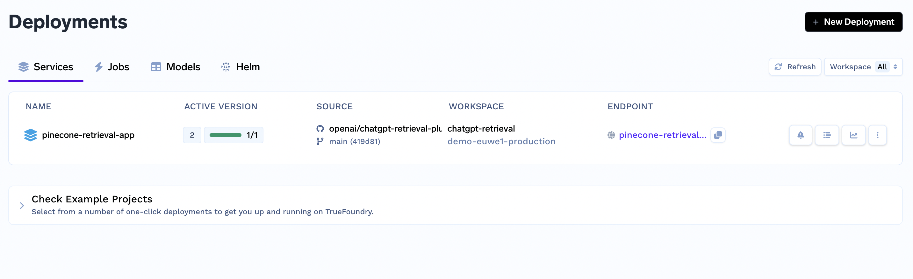

# chatgpt-retrieval-plugin-truefoundry

## A guide to deploying ChatGPT Retrieval Plugin on TrueFoundry

To deploy the Docker container from this repository to TrueFoundry, follow these steps:

1. Create a free account with [TrueFoundry](https://app.truefoundry.com/) and create a new workspace with a unique name.
2. Go to the [secrets console](https://app.truefoundry.com/secrets). Create a new secret group and create secrets for your chosen vector DB
    
3. Go to the [deployment console](https://app.truefoundry.com/deployments). Create a new service in your workspace.
    
4. Set the source to the Github repo for the plugin and the build to DockerFile build.
   
5. Set the port to 8080
   
6. Add the environment variables and set them to the secrets you just created.
   
7. Deploy and your plugin webapp and endpoint should show up in the [deployments tab](https://app.truefoundry.com/deployments).
    

